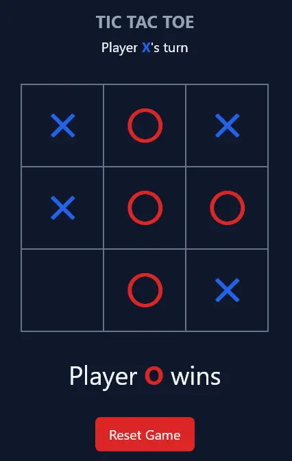

# Tic Tac Toe

Simple classic game written in [Vue](https://vuejs.org/), [Typescript](https://www.typescriptlang.org/) and [TailwindCSS](https://tailwindcss.com/).

## Features

- Players have two different colors
- Shows who's to play this turn
- Announces winner
- Reset button (also it's background color reacts to that of the winner's)

## Screenshot

